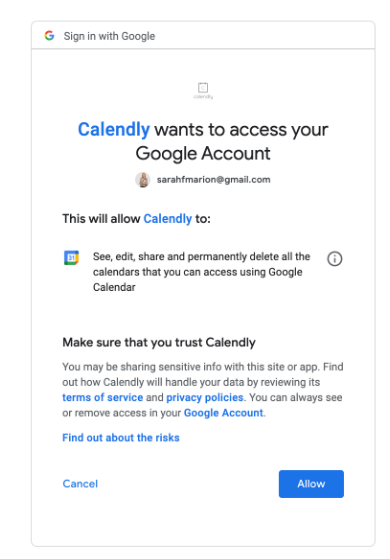
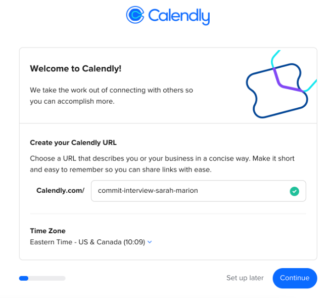
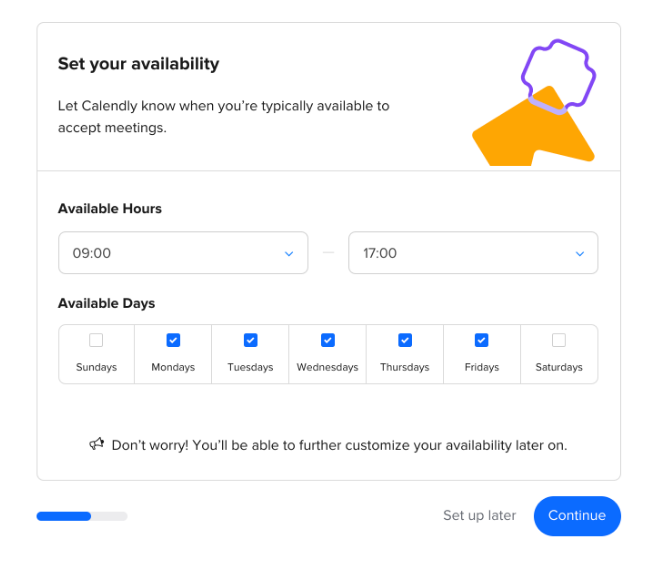
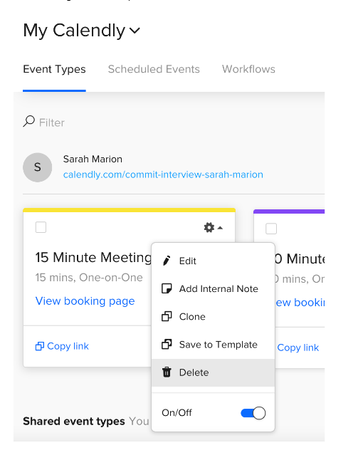
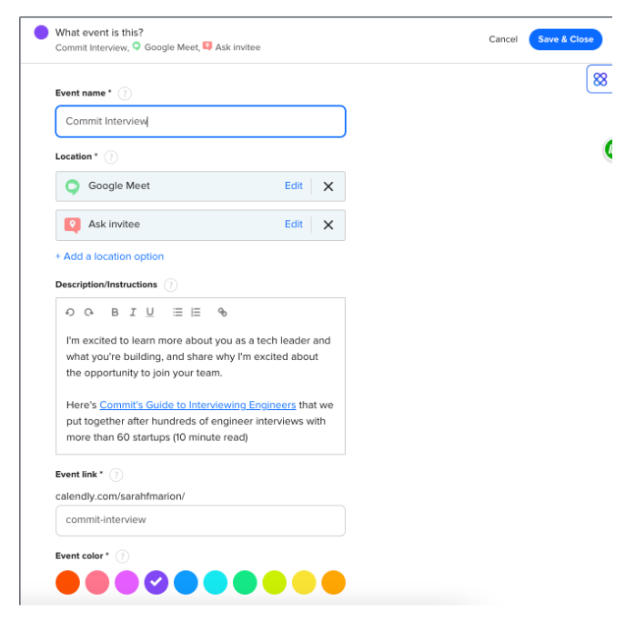
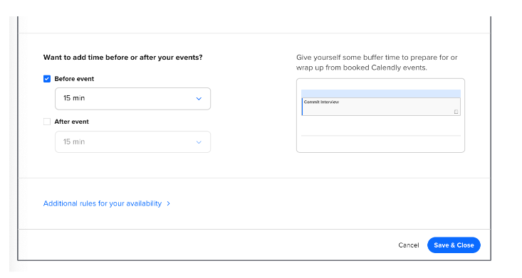
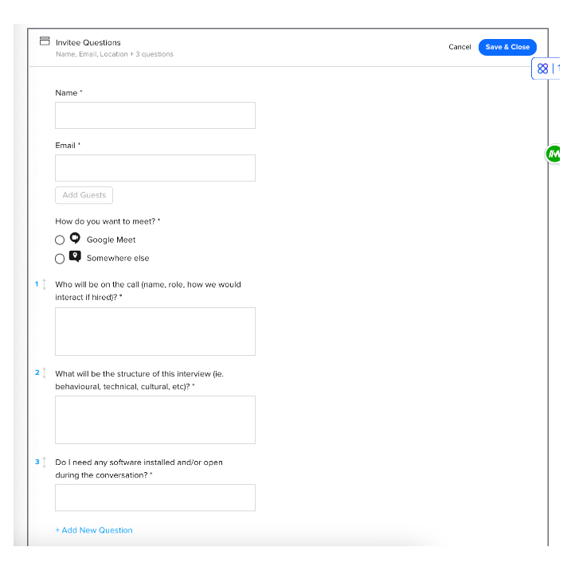
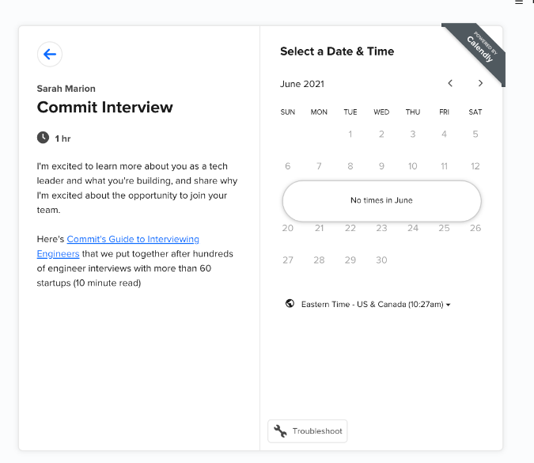
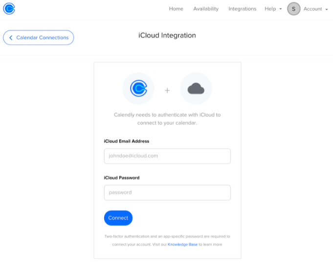

## How to Setup Calendly for Commit Interviews

### Tl;dr (but please read all the instructions!)
1. Exclusively enable 60 minute meetings only
2. Zoom/meets? Can’t do free meeting > 40 mins if there are more than two people 
3. Require the other person’s name
4. Require them to indicate structure of the meeting as a q
5. Include personalized bio, blurb on commit and link to our interviewing rules
6. Free trial has some limitations with calendar syncing (sorry!)
 
### Step 1: Create a free Calendly account
Use your personal email

### Step 2: Create your Calendly URL
Follow the format calendly.com/firstnamelastname. Note that this might be taken already, and so you might want to try variations on your name (ie. my real URL is calendly.com/sarahfmarion)

### Step 3: Set your available hours.
This will impact when startups can interview you. Feel free to keep the suggested hours, or modify them to accommodate child pickup/dropoff or other commitments!

### Step 4: Disable the 15 minute meeting and 30 minute meeting 
Click the gear icon and select ‘Delete’. The 60 minute meeting is what you’ll use when interviewing with startups!

### Step 5: Click in to edit the 60 Minute Meeting option

### Step 6: Open up ‘What event is this?’ and edit accordingly:
- Edit ‘Event Name’ to Commit Interview
- Add **two location options** (Google Meet, and ‘Ask Invitee’, which will allow the invitee to put in their Zoom link if they’d prefer)
- Edit Description/Instructions to this text (make sure the link doesn’t get dropped while you’re copying/pasting!
> I'm excited to learn more about you as a tech leader and what you're building, and share why I'm excited about the opportunity to join your team.
> 
> Here's Commit's Guide to Interviewing Engineers (click here) that we put together after hundreds of engineer interviews with more than 60 startups (10 minute read)

- Change the event link to make it more descriptive (e.g., calendly.com/yourname/commit-interview)
- Save & Close that section!

### Step 7: Open up “When can people book this event?” and edit accordingly:
- Change the Date Range so invitees can schedule **3 business days** (not calendar days!) into the future
- Make sure the **duration is set to 60 minutes**
- Use your “Working hours” schedule that you’ve already set up
- Add **15 minutes as a buffer before the event** so you have time prep and hype yourself up before interviews!
- Save & Close that section!

Now, click to expand ‘Additional rules for your availability’ and **change start time increments so invitees can see available start times in increments of 15 minutes.
**

### Step 8: Open up “Invitee Questions” in “Additional Options” and edit accordingly: 
- Keep the existing Name and Email fields
- Make sure both “Google Meet” and “Somewhere else” show up under “How do you want to meet”
- Add three additional questions. For each question, you’ll want to make sure that it’s turned ON, that you check the box beside Required, and that the Answer Type is “Multiple Lines”
  - 1) Who will be on the call (name, role, how we would interact if hired)?
  - 2) What will be the structure of this interview (ie. behavioural, technical, cultural, etc)?
  - 3) Do I need any software installed and/or open during the conversation?
- Save & Close that section!

### Step 9: Click into ‘View Live Page” at the top of the page to confirm that your event type is ON and that all the changes took effect! 
You should now have a Calendly booking page that looks like this!

Hopefully your page has open time (mine doesn’t as I’m relatively booked up in the next 3 days!) If you don’t have any availability on your page, send Sarah Marion a note and we can troubleshoot.

### Step 10: Add your personal calendar accounts to check for conflicts that may not be present in your Commit calendar. 

No one wants to have an important appointment scheduled in their personal calendar only to realize that an interview now is also booked at the same time - yikes! To prevent this, you can add more than one calendar account to cross-reference for conflicts when allowing a Startup Partner to book you for an interview. I have added my personal Google calendar, and my iCloud (Apple) calendar for Calendly to check for conflicts before allowing a booking.

Note: This does not mean your SP interviews will get booked into your personal calendar(s).  These will still be booked into your Commit calendar, as seen below under the Add to Calendar section.

Note: Apple users will need to log into their iCloud accounts and set an App Specific Password to allow Calendly access:

1. Sign into appleid.apple.com with your Apple ID (email address) and password. Follow all multi-factor authentication steps if you have MFA enabled.
2. Under the **Sign in and Security** heading, there will be a card for App Specific Passwords. Click the diamond with the dots to create a new app-specific password. You will be asked to give it a name (i.e. - Calendly for Commit). Take a screenshot too if you would like - this will be the only time you’ll be able to view the password.

3. Copy and paste the generated password into Calendly, along with your Apple id email address. Your iCloud calendar is now connected!

