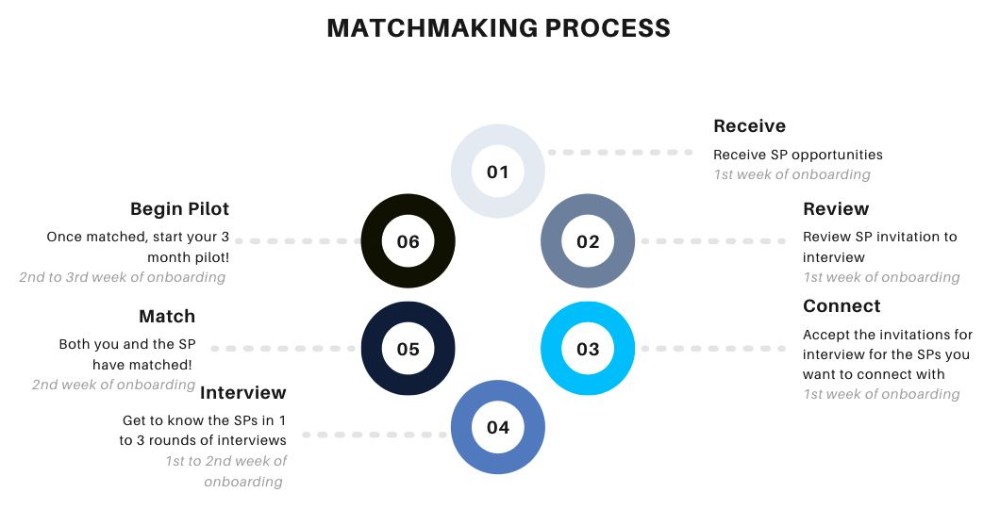

As mentioned, during your first 2 weeks at Commit, and when you return from any pilot(s) in the future, you will go through the matchmaking process. We will match you with a Startup Partner (SP) who is working on problems that excite you and will help you achieve your professional goals.

Our matchmaking process takes you through 6 steps (depicted below) - Receive, Review, Connect, Interview, Match, and Begin Pilot. Let’s walk you through all of them in a bit more detail.
 

## Step 1: Receive 
As part of your onboarding process, you have been asked to [create a profile on the Platform](/epresources/ep-profile-guide), our community platform to allow us to kickstart the matchmaking process.

You are matched with opportunities based on 7 criteria:

1. Tech stack - do you have relevant experience with an SPs tech stack?
2. Industry - do you have relevant work experience in the same industry as the SP?
3. Values - do you share mutual values eg. passion for social justice?
4. Leadership - have you led people/teams previously?
5. Passion - do you have a love for a certain product, skill, or industry problem?
6. Salary - we only submit you to opportunities that are within your salary band.
7. Prior Startup Experience - have you worked in a startup environment before?

We send your profiles to SPs and they can choose to extend an offer for an interview or decline your profile.

## Step 2: Review

A message will be sent to your EPX Slack channel. You'll have the opportunity to review the SPs full profile to better understand:
- Their product
- How the product fits into the current market
- What problem(s) is their product trying to solve
- Their engineering team
- Structure
- Priorities
- Size
- Your potential for impact
 
## Step 3: Connect

In Helix, once you click “Accept”, you’ll get two notifications: 

1. A Slack message in your EPX channel: includes the pros and cons you will have been prompted to share when clicking “Accept” 

2. An email introducing you to the SP: please respond to the email with your Calendly Link ASAP. To set up your Calendly, review [our Calendly guidelines](/epresources/ep-calendly-guide).

Sample Response:

> Hi [NAME],
> 
> I’m really looking forward to learning more about this opportunity and [STARTUP NAME]! Please feel free to find some time that works for you to connect using my Calendly link: [insert link]
> 
> Take care,
> 
> [Your name]
 

## Step 4: Interview

We encourage you to take a look at the [SP Guide to Interviewing Commit Candidates](https://www.notion.so/commitdev/Commit-s-Guide-to-Interviewing-Commit-Engineers-8d8e9f4441e74137b082d0b140bcb454). This guide provides additional insights into how our SPs will approach the interview with you. 

Need additional help preparing for your interview? 

Check out [our Interview Guide for EPs](/epresources/ep-interview-guide) or [book a 20-minute session with Louisa](https://calendly.com/louisasmith) who is not only part of the Engineer Success Team but also a Career Coach. She’d love to do a mock interview with you to shake out all your nerves. 
 
## Step 5: Match

After your interview, you'll be prompted on Slack to share feedback in your EPX Slack channel.

Things to consider when responding:
- What went well?
- What didn’t go so well?
- Would you like to continue with the interview process?
- Anything else you’d like us to know

## Step 6: Begin/Accept Pilot 

The SP typically shares with a member of our Engineer Success team that they want to move forward. A member of our Engineer Success team will let you know the news, and you can choose to accept, defer, or decline.

- If you accept, a member of our Engineer Success team and the SP will work together to determine a start date.
- If you defer, you'll want to make a final decision to accept or decline within 72 hours
- If you decline, you continue the matchmaking process.

A member of our Engineer Success team and the SP will coordinate the paperwork, and will let you know when the paperwork is signed.

Until the paperwork is signed with the SP, it's not a bad idea to continue through the interview process with other companies. The reason here is that it's great to learn more about other teams and cultures, and also keep the door open for future pilots/opportunities. It is always good to be proactive and prepared.

Once it's signed, the SP will reach out via email to begin their onboarding process!

